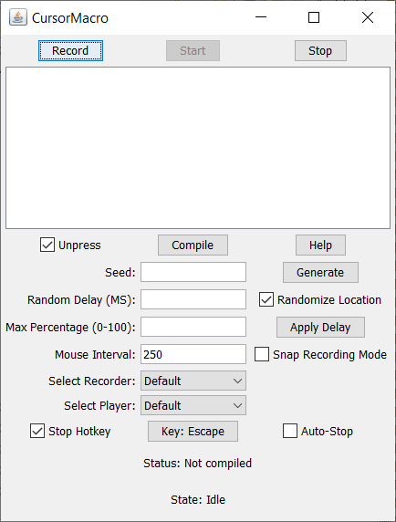

# CursorMacro

A tool for automating mouse and keyboard tasks. Includes a recorder for capturing mouse or keyboard inputs and a player for broadcasting them back.

## Documentation

Read the wiki for details on how each feature works, as well as how to implement your own recorders or players.

## Advantages

- Open source - Code can be adjusted to your needs
- Highly customizable - Many different options for running the player or recorder
- Extendable base - You can add custom recorders or players to suit your needs if the options aren't enough
- Seed randomizer - Instead of having a randomizer that calculates delays at runtime, CursorMacro instead calculates delays beforehand, allowing for a deterministic randomizer
- Delay accounting - The delays are benchmarked to System.currentTimeMillis(), ensuring accurate delays
- Text-based compilation - CursorMacro uses a text pane to compile the script needed for the player, allowing you to use your favorite text editor to tweak the script beforehand

## Disadvantages

- The Java mouseMove() function is bugged and often needs multiple mouse moves to reach the target (and sometimes the mouse move misses!), resulting in the mouse jumping back and forth and adding to the delay
- The text-editor gets very messy when the script is long

## Screenshots

